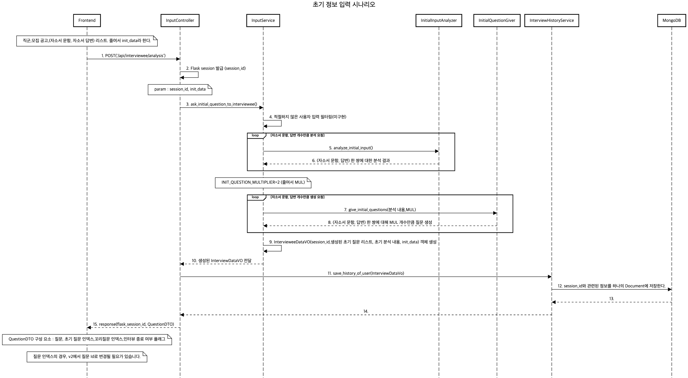
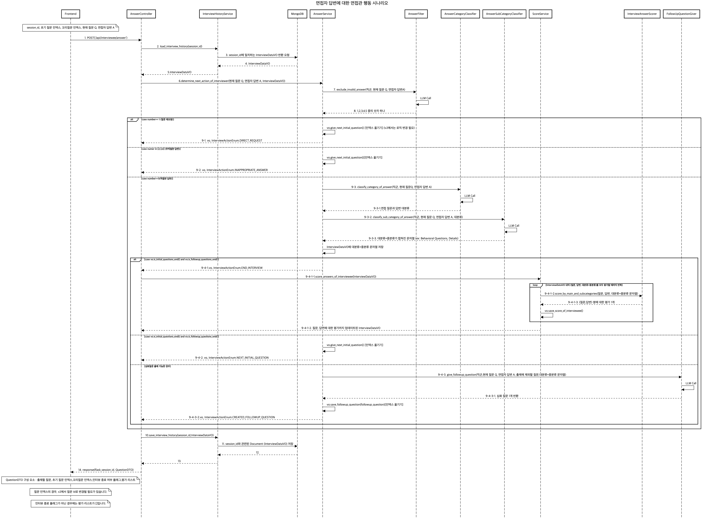
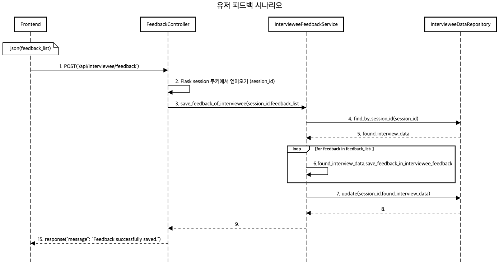

# Moview Core Serivce

## MVP v1 기준

(request,response에서 인덱스로 되어 있는 부분은 MVP v2에서 db id로 변경해야 합니다.)

### API 명세서
#### /api/interviewee/analysis
```
method : POST
request: json(직군,모집 공고,(자소서 문항, 자소서 답변) 리스트)
response: cookie(세션id) ,json(초기 질문 첫 번째, 초기 질문 인덱스,꼬리질문 인덱스,인터뷰 종료 여부 플래그)
description: 자소서 분석, 초기 질문리스트 생성
frontend: InputPage → ChatPage
GPT call: O
```

#### /api/interviewee/answer
```
method : POST
request:cookie(세션id),json(초기 질문 인덱스, 꼬리질문 인덱스, 현재 질문 Q, 면접자 답변 A)
response: json(출제할 질문, 초기 질문 인덱스,꼬리질문 인덱스,인터뷰 플래그, 답변 평가 리스트) 
description: 인터뷰 플래그에 따른 response 설명
    - InterviewActionEnum.END_INTERVIEW : 출제할 질문 X, 초기 질문 인덱스 ,꼬리질문 인덱스, END_INTERVIEW, 답변 평가 리스트 [길이 : 초기 질문 개수 + 꼬리 질문 개수] (답변 평가 리스트에는 면접 답변 [i]에 대한 좋은 점 + 아쉬운 점 + 점수 문자열이 저장되어 있음)
    - InterviewActionEnum.NEXT_INITIAL_QUESTION : 출제할 질문 , 초기 질문 인덱스 + 1 ,꼬리질문 인덱스 0 , NEXT_INITIAL_QUESTION, 답변 평가 리스트 [길이 0]
    - InterviewActionEnum.CREATED_FOLLOWUP_QUESTION : 출제할 질문 , 초기 질문 인덱스 ,꼬리질문 인덱스 +1 , CREATED_FOLLOWUP_QUESTION, 답변 평가 리스트 [길이 0]
    - InterviewActionEnum.INAPPROPRIATE_ANSWER : 출제할 질문 , 초기 질문 인덱스 + 1 ,꼬리질문 인덱스 0 , INAPPROPRIATE_ANSWER, 답변 평가 리스트 [길이 0]
    - InterviewActionEnum.DIRECT_REQUEST : 출제할 질문 , 초기 질문 인덱스 + 1 ,꼬리질문 인덱스 0 , INAPPROPRIATE_ANSWER, 답변 평가 리스트 [길이 0]
frontend:
    - InterviewActionEnum.END_INTERVIEW: ChatPage → FeedbackPage (FeedBackPage에서 각 답변에 대해 좋은점 + 아쉬운 점 + 점수 문자열 출력. 파싱 x)
    - InterviewActionEnum.NEXT_INITIAL_QUESTION: ChatPage에서 질문 출제
    - InterviewActionEnum.CREATED_FOLLOWUP_QUESTION: ChatPage에서 질문 출제
    - InterviewActionEnum.INAPPROPRIATE_ANSWER: ChatPage에서 질문 출제 + 경고 메시지 출력
    - InterviewActionEnum.DIRECT_REQUEST: ChatPage에서 질문 출제
GPT call: O
```

#### /api/interviewee/feedback
```
method : POST
request: cookie(세션id), json(각 답변분석에 대한 유저의 평가)
response: X
description: 유저의 서비스평가를 받고, 종료
frontend: FeedbackPage → EndPage 
GPT call: X
```

***

### 시퀀스 다이어그램

#### /api/interviewee/analysis



#### /api/interviewee/answer


#### /api/interviewee/feedback

***