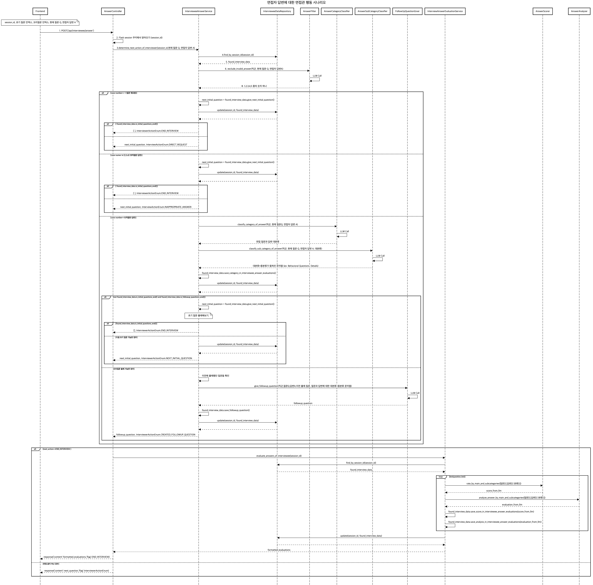

# Moview Core Serivce

## MVP v1 기준

### API 명세서

#### /interviewee/session

```
method : POST
request: X
response: cookie(세션id)
description: 플라스크 세션 발급용 API. v2에선 필요 없어짐.
frontend: 변환 없음.
GPT call: X
```

#### /api/interviewee/input

```
method : POST
request: json(직군,모집 공고,(자소서 문항, 자소서 답변) 리스트)
response: cookie(세션id) ,json(초기 질문 첫 번째, START_INTERVIEW)
description: 자소서 분석, 초기 질문리스트 생성
frontend: InputPage → ChatPage
GPT call: O
```

#### /api/interviewee/answer

```
method : POST
request:cookie(세션id),json(초기 질문 인덱스, 꼬리질문 인덱스, 현재 질문 Q, 면접자 답변 A)
response: json(출제할 질문,인터뷰 플래그) 
description: 인터뷰 플래그에 따른 response 설명
    - InterviewActionEnum.END_INTERVIEW : 답변 평가 리스트 [길이 : 초기 질문 개수 + 꼬리 질문 개수] (답변 평가 리스트에는 면접 답변 [i]에 대한 좋은 점 + 아쉬운 점 + 점수 문자열이 저장되어 있음), END_INTERVIEW
    - InterviewActionEnum.NEXT_INITIAL_QUESTION : 출제할 질문 , NEXT_INITIAL_QUESTION
    - InterviewActionEnum.CREATED_FOLLOWUP_QUESTION : 출제할 질문 ,  CREATED_FOLLOWUP_QUESTION
    - InterviewActionEnum.INAPPROPRIATE_ANSWER : 출제할 질문 , INAPPROPRIATE_ANSWER
    - InterviewActionEnum.DIRECT_REQUEST : 출제할 질문 , DIRECT_REQUEST
frontend:
    - InterviewActionEnum.END_INTERVIEW: ChatPage → FeedbackPage (FeedBackPage에서 각 답변에 대해 좋은점 + 아쉬운 점 + 점수 문자열 출력. 파싱 x)
    - InterviewActionEnum.NEXT_INITIAL_QUESTION: ChatPage에서 질문 출제
    - InterviewActionEnum.CREATED_FOLLOWUP_QUESTION: ChatPage에서 질문 출제
    - InterviewActionEnum.INAPPROPRIATE_ANSWER: ChatPage에서 질문 출제 + 경고 메시지 출력
    - InterviewActionEnum.DIRECT_REQUEST: ChatPage에서 질문 출제
GPT call: O
```

#### /api/interviewee/feedback

```
method : POST
request: cookie(세션id), json(각 답변분석에 대한 유저의 평가)
response: X
description: 유저의 서비스평가를 받고, 종료
frontend: FeedbackPage → EndPage 
GPT call: X
```

***

### 시퀀스 다이어그램

#### /api/interviewee/input


#### /api/interviewee/answer



#### /api/interviewee/feedback


***

### 테스트 커버리지

moview 디렉토리 기준 라인 커버리지 88%
***

### 디렉토리 트리

moview 디렉토리에서 'tree' 명령어를 실행한 결과 (homebrew에서 tree 설치해야 함.)

```
.
├── __init__.py
├── __pycache__
│   └── __init__.cpython-310.pyc
├── config
│   ├── __init__.py
│   ├── db
│   │   ├── __init__.py
│   │   ├── mongo_config.py
│   │   └── mongo_handler.py
│   ├── llm
│   │   ├── __init__.py
│   │   └── custom_callback_handler.py
│   └── loggers
│       ├── __init__.py
│       ├── __pycache__
│       └── mongo_logger.py
├── controller
│   ├── __init__.py
│   ├── __pycache__
│   │   ├── __init__.cpython-310.pyc
│   │   ├── interviewee_answer_controller.cpython-310.pyc
│   │   ├── interviewee_feedback_controller.cpython-310.pyc
│   │   ├── interviewee_session_controller.cpython-310.pyc
│   │   └── interviwee_input_controller.cpython-310.pyc
│   ├── interviewee_answer_controller.py
│   ├── interviewee_feedback_controller.py
│   ├── interviewee_session_controller.py
│   └── interviwee_input_controller.py
├── domain
│   ├── __init__.py
│   └── entity
│       ├── __init__.py
│       ├── __pycache__
│       ├── interviewee_data_main_document.py
│       └── interviewee_data_subdocument.py
├── environment
│   ├── __init__.py
│   ├── __pycache__
│   │   ├── __init__.cpython-310.pyc
│   │   ├── environment_loader.cpython-310.pyc
│   │   └── llm_factory.cpython-310.pyc
│   ├── environment_loader.py
│   └── llm_factory.py
├── modules
│   ├── __init__.py
│   ├── __pycache__
│   │   └── __init__.cpython-310.pyc
│   ├── answer_evaluator
│   │   ├── __init__.py
│   │   ├── __pycache__
│   │   │   ├── __init__.cpython-310.pyc
│   │   │   ├── answer_analyzer.cpython-310.pyc
│   │   │   └── answer_scorer.cpython-310.pyc
│   │   ├── answer_analyzer.py
│   │   └── answer_scorer.py
│   ├── input
│   │   ├── __init__.py
│   │   ├── __pycache__
│   │   │   ├── __init__.cpython-310.pyc
│   │   │   ├── initial_question_giver.cpython-310.pyc
│   │   │   └── input_analyzer.cpython-310.pyc
│   │   ├── initial_question_giver.py
│   │   └── input_analyzer.py
│   └── question_generator
│       ├── __init__.py
│       ├── __pycache__
│       │   ├── __init__.cpython-310.pyc
│       │   ├── answer_category_classifier.cpython-310.pyc
│       │   ├── answer_filter.cpython-310.pyc
│       │   ├── answer_sub_category_classifier.cpython-310.pyc
│       │   ├── answer_subcategory_classifier.cpython-310.pyc
│       │   └── followup_question_giver.cpython-310.pyc
│       ├── answer_category_classifier.py
│       ├── answer_filter.py
│       ├── answer_sub_category_classifier.py
│       └── followup_question_giver.py
├── repository
│   ├── __init__.py
│   ├── __pycache__
│   │   ├── __init__.cpython-310.pyc
│   │   └── interviewee_data_repository.cpython-310.pyc
│   └── interviewee_data_repository.py
├── service
│   ├── __init__.py
│   ├── __pycache__
│   │   └── __init__.cpython-310.pyc
│   ├── interviewee_answer
│   │   ├── __init__.py
│   │   ├── __pycache__
│   │   │   ├── __init__.cpython-310.pyc
│   │   │   ├── interviewee_answer_service.cpython-310.pyc
│   │   │   └── interviewer_action_enum.cpython-310.pyc
│   │   ├── interviewee_answer_service.py
│   │   └── interviewer_action_enum.py
│   ├── interviewee_evaluation
│   │   ├── __init__.py
│   │   ├── __pycache__
│   │   │   ├── __init__.cpython-310.pyc
│   │   │   └── interviewee_answer_evaluation_service.cpython-310.pyc
│   │   └── interviewee_answer_evaluation_service.py
│   ├── interviewee_feedback
│   │   ├── __init__.py
│   │   ├── __pycache__
│   │   │   ├── __init__.cpython-310.pyc
│   │   │   └── interviewee_feedback_service.cpython-310.pyc
│   │   └── interviewee_feedback_service.py
│   └── interviewee_input
│       ├── __init__.py
│       ├── __pycache__
│       │   ├── __init__.cpython-310.pyc
│       │   └── interviewee_input_service.cpython-310.pyc
│       └── interviewee_input_service.py
└── utils
    ├── __init__.py
    ├── __pycache__
    │   ├── singleton_meta_class.cpython-310.pyc
    │   └── util.cpython-310.pyc
    ├── prompt_loader
    │   ├── __init__.py
    │   ├── __pycache__
    │   ├── json
    │   │   ├── AnswerAnalyzer.json
    │   │   ├── AnswerCategoryClassifier.json
    │   │   ├── AnswerFilter.json
    │   │   ├── AnswerScorer.json
    │   │   ├── AnswerSubCategoryClassifier.json
    │   │   ├── FollowUpQuestionGiver.json
    │   │   ├── InitialQuestionGiver.json
    │   │   ├── InputAnalyzer.json
    │   │   └── helpme.md
    │   └── prompt_loader.py
    └── singleton_meta_class.py
```
***
